# Assignment 3: 3D Scene Editor

## 1.1 Scene Editor

In order to let the faces cover other faces at correct order, we need to 
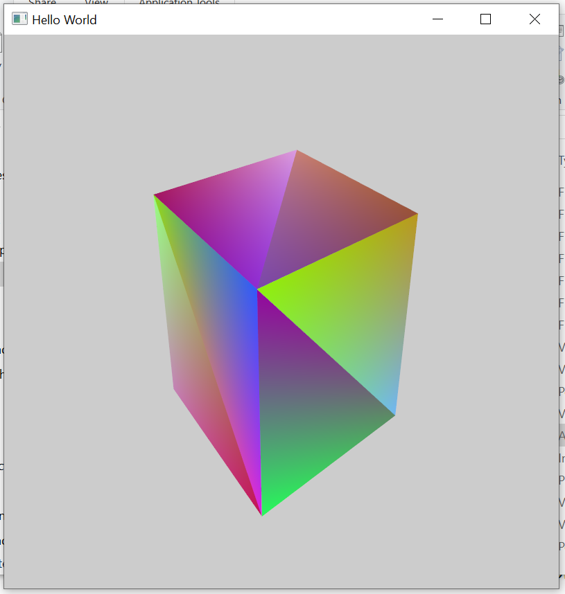

## 1.2 Object Control

## 1.3 Camera Control

To translate the position of the camera and the camera should always point to the origin.
We can use `glm::lookAt` to set `View` matrix. If we set the second argument of `glm::lookAt` as `glm::vec3(0, 0, 0)` then we can make the camera always point to the origin. Then what we need to do is change the position of the camera (which is described in the first argument of `glm::lookAt`).

We use `W` (Camera Up), `S` (Camera Down), `A` (Camera Left), `D` (Camera Right), `-` (Camera Zoom Out), `+` (Camera Zoom In) to control the camera.
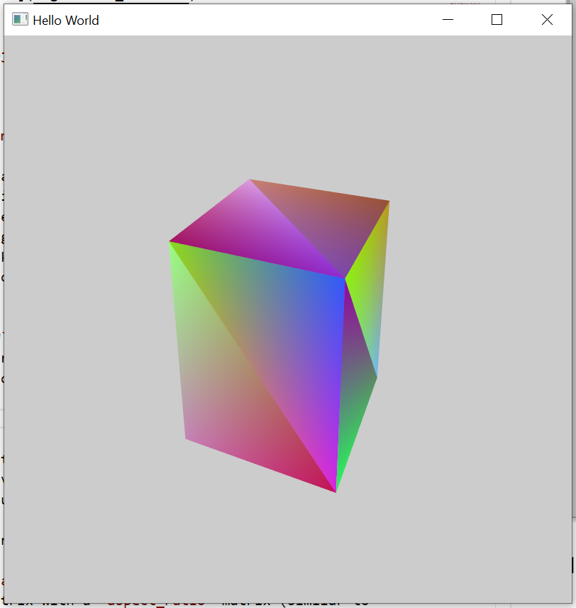
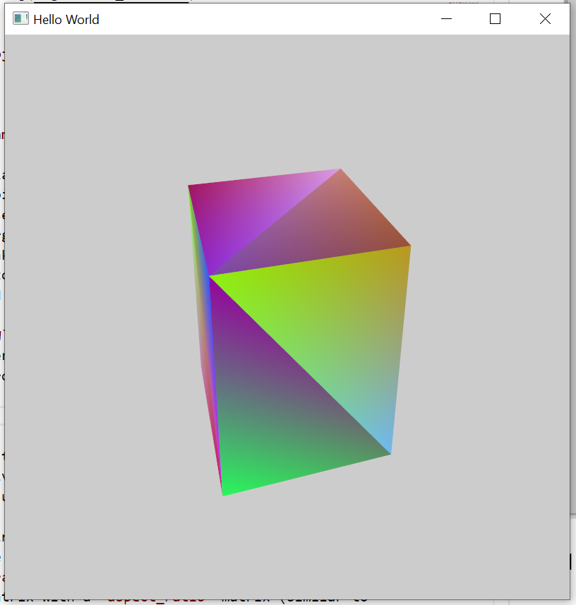
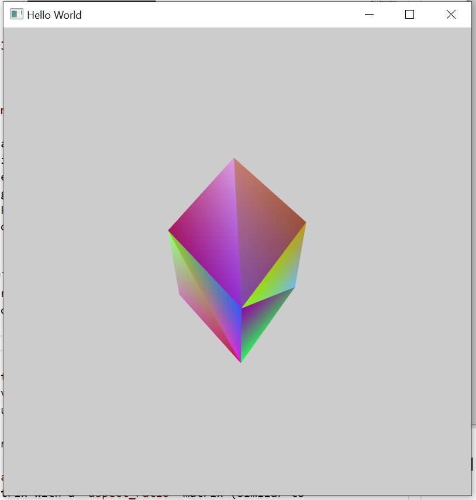
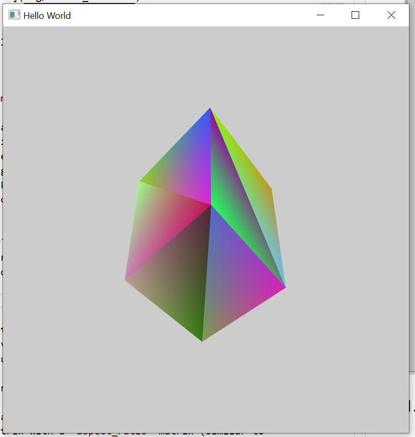
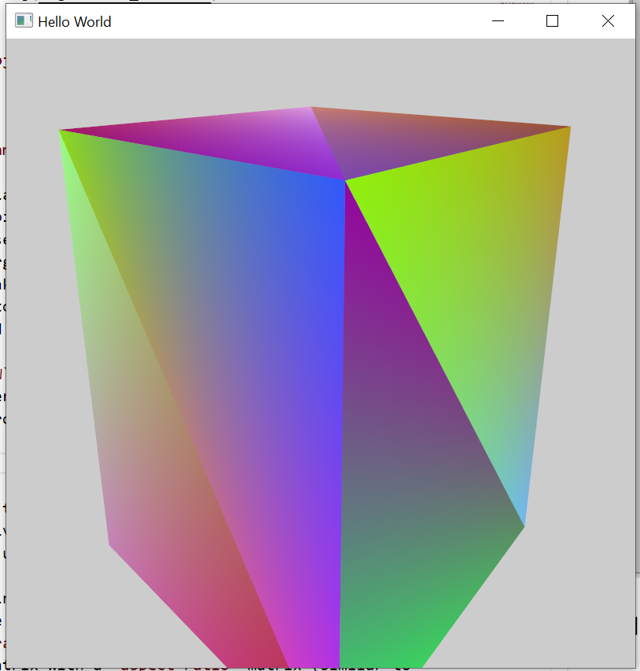
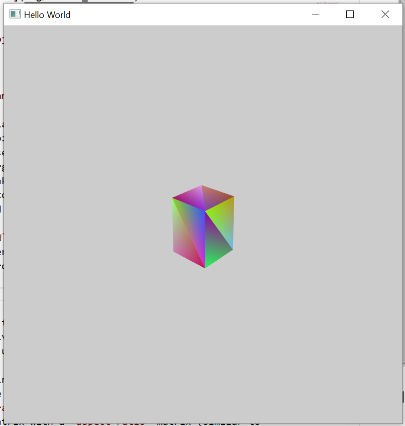

In order to implement both a orthographic camera and a perspective camera, we just need to set 2 different projection matrices using `glm::perspective` and `glm::ortho`.
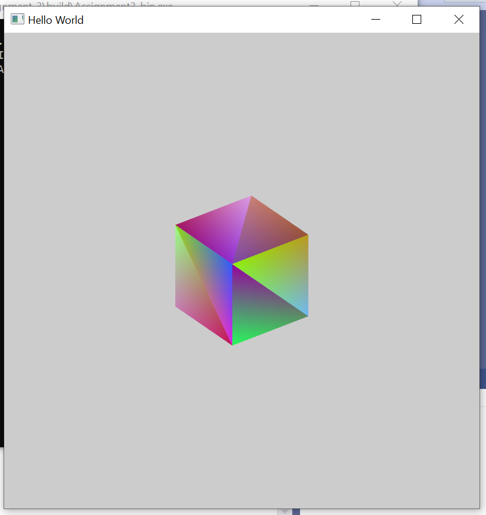

To take into account the size of the window, we have to calculate the aspect ratio each time we render a scene, `aspect_ratio = height / width`, then we just multiple the `View` matrix with a `aspect_ratio` matrix (similar to identical matrix but the first element is `aspect_ratio`).
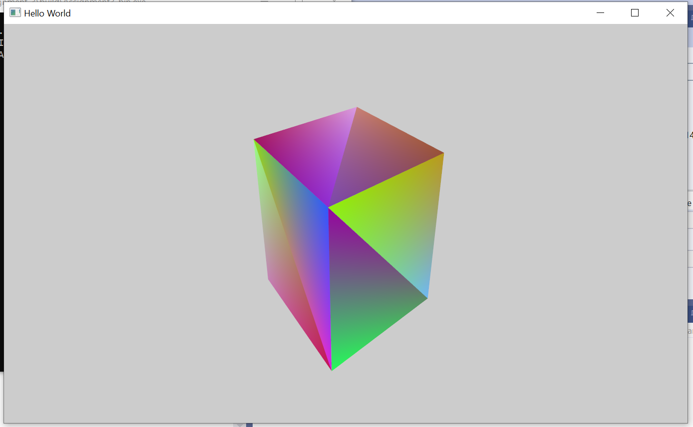

## 1.4 Animation Mode

## 1.5 Export in SVG format

## 1.6 Trackball

Similar to 1.3, what we need to do is just change the way the camera moves. In order to move on the surface of the sphere, we just have to make do an extra algebra calculate.

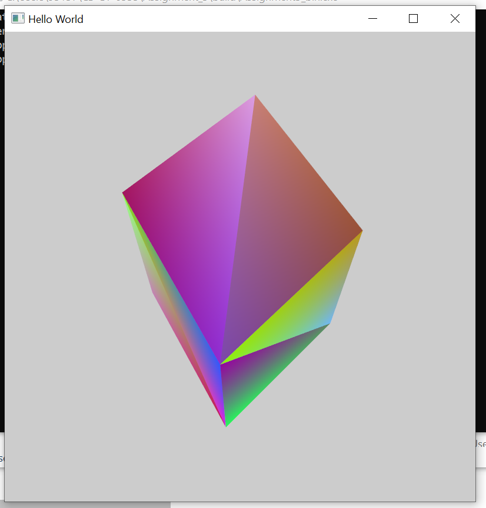
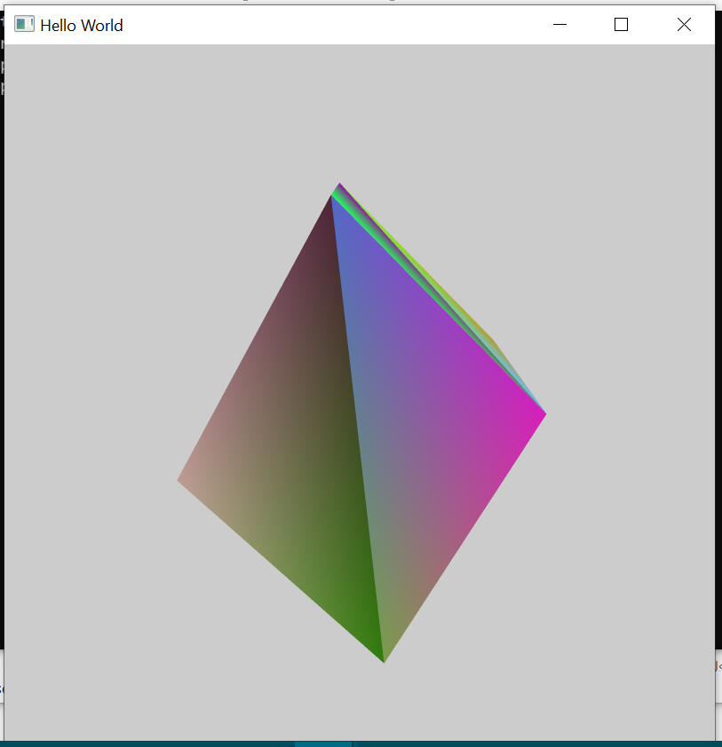