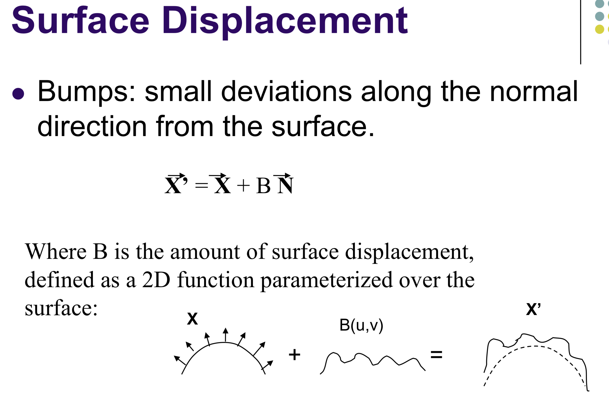

# Texture Mapping

This project is mainly related to texture mapping that we learned in class.

Implements 4 types of texture mapping (Bump, Normal, Parallax, Distance) and compare the differences between them.

In order to show the basic image of the texture for easy comparison, I also implemented the basic shading.

Due to the limitation of my skill of OpenGL, I have to make a seperate folder for each texture mapping technology. Therefore, there are totally 5 folders: `Shading/`, `Bumpmap/`, `Normalmap/`, `Parallaxmap/`, `Displacementmap/`. And each folder needs `cmake ../` and `make` to compile.

This is the texture we used in this project:

This is the generated corresponded height map:

This is the generated corresponded normal map:

## 1.0 Basic Shading

The basic shading and texture mapping is just map the color of the texture to the surface of the object, and we use Phong shading (Ambient + Diffuse + Specular) to show the light effect.

Here is the result of basic Phong shading and texture mapping:

## 1.1 Bump Mapping

Instead of encoding colors in a texture, we encode the height normals of a scence into a greyscale image to simulate the true shading. The math is shown in this picture:

The specific algorithm is based on this document: [Bump Mapping](http://web.cse.ohio-state.edu/~shen.94/781/Site/Slides_files/bump.pdf)

Here is the result of bump mapping:

## 1.2 Normal Mapping

Very similar to Bump Mapping, but instead of encoding normals into a greyscale image, we encode normals into a RGB image (which respectively represents the x, y, z coordinates of the normals). The math is shown in this picture:

Where t, b, n are tangent vector, bitangent vetor and normal vector.

The specific algorithm is based on this tutorial: [opengl-tutorial](http://www.opengl-tutorial.org/intermediate-tutorials/tutorial-13-normal-mapping/)

Here is the result of normal mapping:

## 1.3 Parallax mapping

Parrallax mapping is an approximation of displacement mapping.

Parrallax mapping is implemented by displacing the texture coordinates at a point on the rendered polygon by a function of the view angle in tangent space.

The specific algorithm is based on this article: [Detailed shape representation with parallax mapping](https://www.researchgate.net/profile/Susumu_Tachi/publication/228583097_Detailed_shape_representation_with_parallax_mapping/links/02e7e518259abdc882000000.pdf)

Here is the result of parallax mapping:

## 1.4 Displacement mapping

In displacement mapping, instead of encoding normals into an image, we encode displacements into an image. Instead of simulating (cheating) the shading, it is used to cause an effect where the actual geometric position of points over the textured surface are displaced. The specific algorithm can be found in this document: [Displacement Mapping](http://mathinfo.univ-reims.fr/IMG/pdf/Displacement_Mapping_Forsyth_Doggett_.pdf)

In this project, I changed the gl_position by height map and add normal mapping onto it to form a displacement mapping.

But due to the limitation of the small number of vertices of the sphere model, we cannot achieve a very fine result.

Here is the result of displacement mapping:
